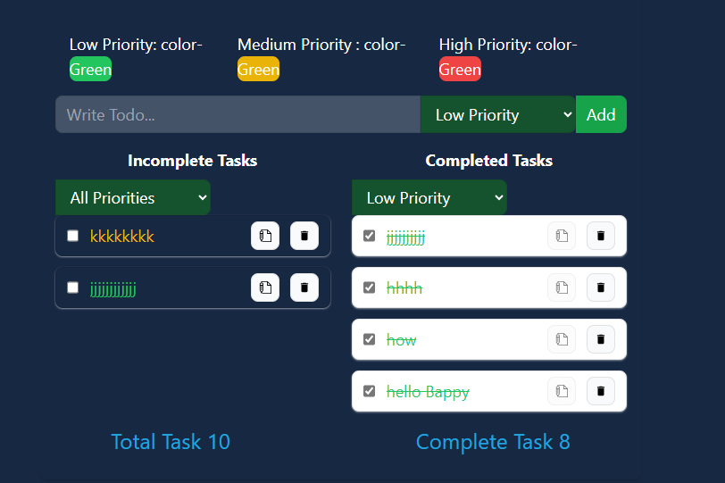

# Todo List App

This Todo List application allows users to manage their tasks efficiently by providing features to add, edit, delete, and mark tasks as complete. It offers a clean and intuitive user interface built using React and styled with Tailwind CSS.

## Features

- **Add Todo**: Users can easily add new tasks by entering the task message and selecting the priority level (low, medium, or high).
- **Edit Todo**: Existing tasks can be edited to update their message.
- **Delete Todo**: Users can remove tasks from the list when they are no longer needed.
- **Complete Todo**: Tasks can be marked as complete, and they are visually differentiated from incomplete tasks.
- **Local Storage**: Todos are persisted in the browser's local storage, allowing users to access their tasks across sessions.
- **Priority Management**: Todos are categorized by priority level (low, medium, or high), providing users with better task organization.
- **Task Statistics**: The application displays statistics such as the total number of tasks and the number of completed tasks, giving users an overview of their progress.

## Components

### TodoForm

Component for adding new todos. It provides a form with input fields for the task message and priority level selection.

### TodoItem

Component representing an individual todo item. It allows users to edit, delete, and mark todos as complete.

### Priority

Component for displaying todos grouped by their priority level.

## Technologies Used

- React
- Tailwind CSS

# Note

## "Here, I select the complete list of low-priority items. So, if at this time, I complete a task which is of high priority, it should not be shown. Go to all properties to display the item."

## Focus Filter option to display list task.

